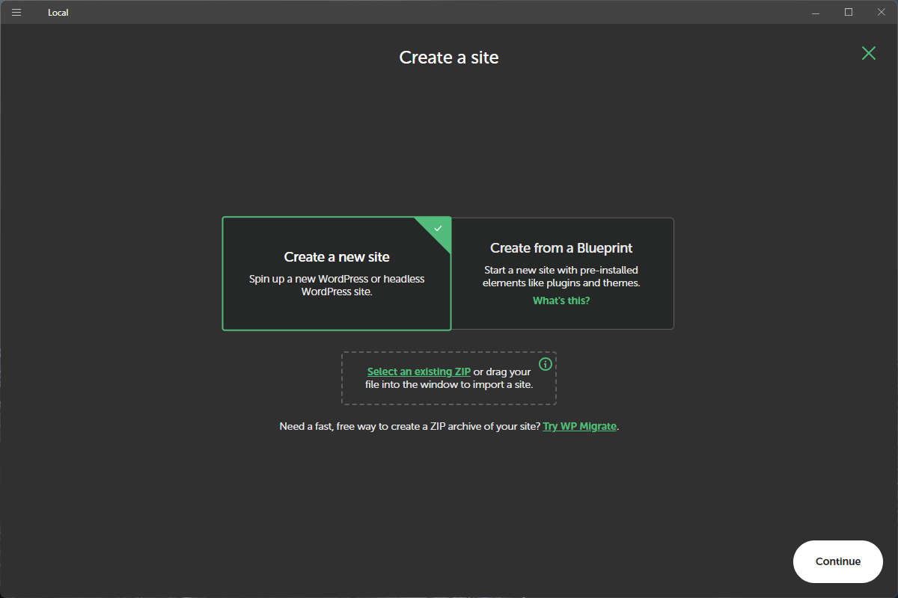

# Environment Setup

## Summary

This repository builds a NextJS based headless site, with content managed via WordPress. During the intial phase of building a headless WordPress site a local instance of WordPress is very helpful for quick interations of testing.

Because of the unique requirements for WordPress (PHP, MySQL, etc...) the easiest way to get up and running on a Windows based machine is via a third-party containerization tool called **Local**. [Local](https://localwp.com) is maintained by [WP Engine](https://wpengine.com/about-us/) the premier hosting service for headless WordPress implementations.

## Install Local

1. Download Local from **[https://localwp.com/](https://localwp.com/)**.
2. Run the installer.
   1. When prompted to choose who to install for select **All Users**.
   2. Accept the default install location, and click **Install**.
   3. On completion of install allow Local to run.

3. From the *Local Sites* tab, click the **Plus Icon** to create a new WordPress site

4. Once in the *Create a Site* wizard, select **Create a new site** option.

5. Provide a name for the site, example *Rainfly Adventures*.
6. Accept the default environment setup of **Preferred**.

7. Finally, you'll need to provide a default admininstrator account. Enter the following or something similar:
   1. Username -> admin
   2. Password -> b
   3. E-mail -> accept the default

8. Upon site setup completion, Local will start the site and display the following details with in the *Local Sites* tab.
9. Click **Trust** next to the SSL certificate name, to add the cert to the certificate store and avoid SSL warnings in the browser.


!!!error Error Message About Routing
    If you receive error message about routing failing, that is because Local is fighting with IIS for control of ports 80 and 443. Easiest fix is to stop IIS while working with WordPress sites through Local
    
    ```iisreset /stop```
