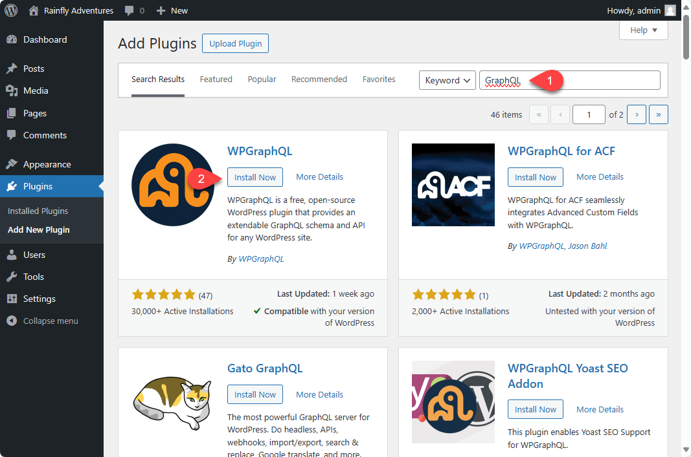

# Configuring WordPress

## Summary

WordPress by default provides solid functionality for managing basic content needs, but to get the most out of the product an extensive plugin ecosystem has developed allowing for easy extending of the core products features. By default WordPress expects to render content via PHP templates on the server, to provide the functionality to support headless (i.e. rendering of the site outside of the WordPress server), the following plugins are used.

- WP GraphQL
  - is a free, open-source WordPress plugin that provides an extendable GraphQL schema and API for any WordPress site.
- WP GraphQL Content Blocks
  - is a plugin that allows querying Gutenberg blocks using WPGraphQL. [https://faustjs.org/tutorial/get-started-with-wp-graphql-content-blocks](https://faustjs.org/tutorial/get-started-with-wp-graphql-content-blocks)
- Faust.js
  - Faust.js™ transforms your traditional WordPress installation into a flexible headless CMS.

## Installing Plugins

1. Launch the *WP Admin* by clicking **WP Admin** from local.
2. Enter the admin credentials when prompted.
3. From the WP Admin dashboard click **Plugins**.

4. On the Plugins screen, click **Add New Plugin**.

5. In the search bar enter **GraphQL** (note, that on key-up the search will trigger, no need to hit enter.)
6. Click **Install Now** for *WPGraphQL*.
7. Click **Activate** for *WPGraphQL*.

8. In the search bar enter **Faust** (note, that on key-up the search will trigger, no need to hit enter.)
9. Click **Install Now** for *Faust.js*.
10. Click **Activate** for *Faust.js*.

11. Finally, *WP GraphQL Content Blocks* is not found in the plugin library, and must be downloaded and installed manually.
12. Go to [https://github.com/wpengine/wp-graphql-content-blocks](https://github.com/wpengine/wp-graphql-content-blocks)
13. Click on **Releases**
14. For the current release download the plugin zip, **wp-graphql-content-blocks.zip**.

15. Back on the Plugin dashboard click **Upload Plugin**
16. A file selector will display, click on **Choose File** and select the downloaded zip from step 14.
17. With the plugin zip selected, you can click **Install Now** to install the plugin.

18. On successful install you will be prompted to Acitvate, click **Activate Plugin**. (If there is an error it will display on this screen instead of the Activate option.)

19. You will then be redirected to the installed plugins list, which should look similar to the following. Make sure all the plugins are listed as 'activated, if not activate them now.

20. Optional, but good practice is to turn on auto-updates for any plugin that allows it.
