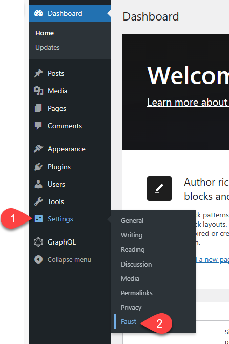
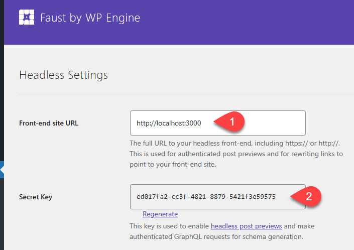
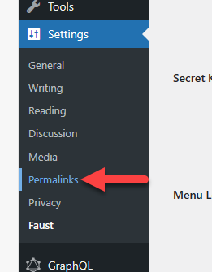
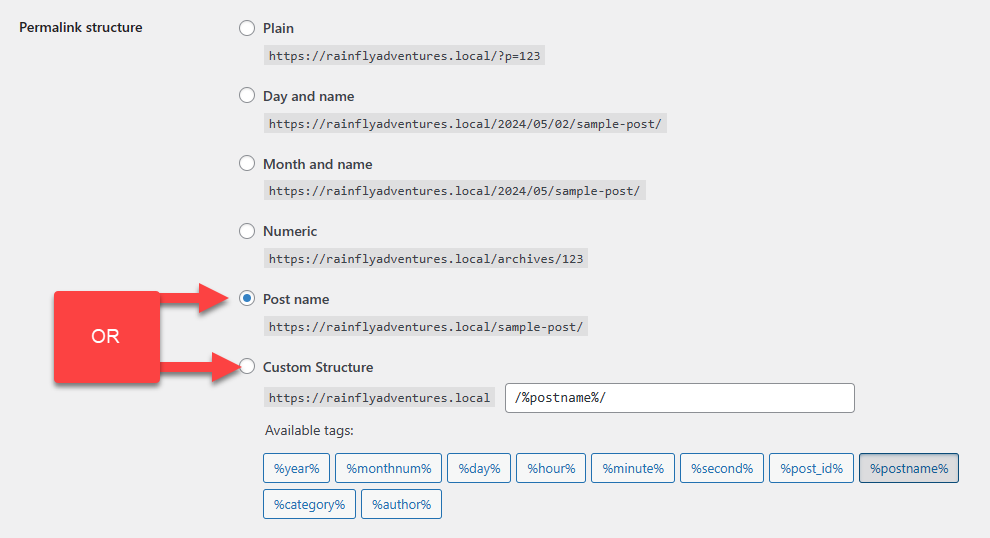

# Configuration of Fuast in WordPress

## Summary

Faust.js is an SDK that helps to manage the communication between the GraphQL endpoints on WordPress and the headless rendering code (Next.js). For this to work, there are a few steps that need to be accomplished.

## Steps

1. From the WP Admin screen, hover over **Settings** to get the sub-menu
2. From the sub-menu select **Faust**

3. The first field to complete is **Front-end site URL**. This field tells WordPress where the headless rendering code runs from. For a local environment, this should be updated to be **http://localhost:3000**
   1. If your headless code is configured to use a different domain and port, enter that.
4. Copy the **Secret Key** for use in the code's .env configuration file.

5. Click **Save Changes**
6. From the *Settings* sub-menu select **Permalinks**

7. Confirm that the Permalink Structure is set to **Post Name**

