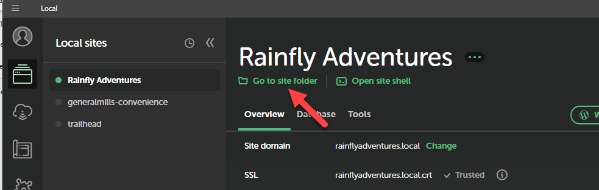
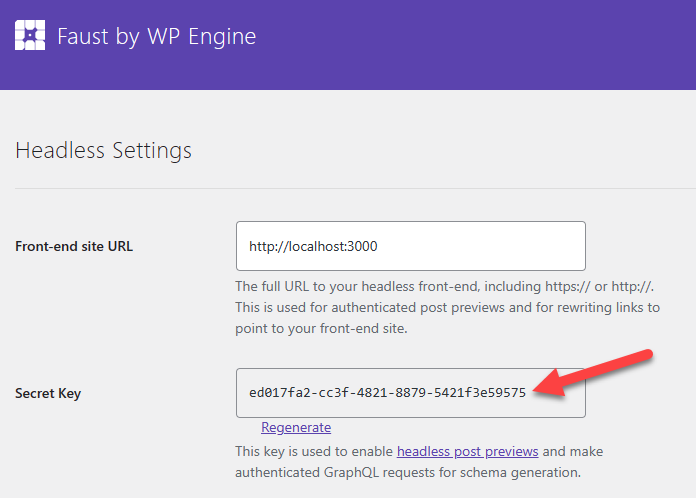

# Setting Local Development Configuration File

## Summary

Once the proper plugins are in place for your site,there are a few final steps to get your code aligned to WordPress.

## Create the *.env* Configuration File

1. Open the source code directory in VS Code.
2. Copy *.env.local.sample*
3. Rename the copy as **.env.local**
4. This file is by default ignored by Git, and is where localized configuration values will be placed.

## Set Local Configuration Values

Following changes are made to **.env.local**

1. From Local copy the **Site domain** value.
2. In *.env.local*, update the value for **NEXT_PUBLIC_WORDPRESS_URL** with the *Site Domain*. (Be sure to include http or https.)
3. In *.env.local*, update the value for **NEXT_PUBLIC_GRAPHQL_ENDPOINT** with the *Site Domain*.
4. Add the suffix of **/graphql** to the domain url.
5. From Local, click the icon for **Go to site folder**
6. In the file browser that opens copy the path.
7. In *.env.local*, update the value for **PLUGIN_DIRECTORY**, by appending the suffix path of ```\app\public\wp-content\plugins``` to the file path.

8. In *.env.local*, update the value for **FAUST_SECRET_KEY** based on the Secret taken from the Faust setting screen in the WP Admin.


The final *.env.local* should looks something like the following for the example Rainfly Adventures site:

```bash
NEXT_PUBLIC_WORDPRESS_URL=https://rainflyadventures.local
NEXT_PUBLIC_GRAPHQL_ENDPOINT=https://rainflyadventures.local/graphql
# Plugin secret found in WordPress Settings->Headless
FAUST_SECRET_KEY=d4c14ba5-ac3a-4f75-a315-ae1b4ebdd086
#https://faustjs.org/reference/debugging
FAUST_DEBUG=true
PLUGIN_DIRECTORY='C:\Users\sgillis.PLW9521\Local Sites\rainflyadventures\app\public\wp-content\plugins'
```

## Configure the WordPress Plugin file

The default codebase includes files to support the creation of a WordPress plugin.This has been done to allow custom blocks to share resources from the rendered sites HTML and styles.

1. Rename **rainflyadventures-plugin.php** to your own site's name. (The rest of the instructions will refer to this as the 'plugin file'.)
2. Open the *plugin file*.
3. In the comment section, update the following field as they apply to your site:
   1. Plugin Name
   2. Description
   3. Author
   4. Text Domain
4. Line 30, is the key registration action used by WordPress to load the plugin. Rename this as applicable.
5. Line 35, will need to be udpdated to match the function name from step 4.
