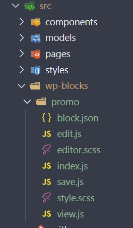

# Review of NPM Scripts

## Summary

When working with JavaScript frameworks, such as Next.JS, many commands and instructions that need to be ran are performed through ```npm```. Specific scripts and commands are contained in the package.json file of the application.

This is a walkthrough of the key commands defined for this project.

## Package.json List

Here is a look at only the 'scripts' section of package.json

```json
{
  "scripts": {
    "sync-types": "faust generatePossibleTypes",
    "dev": "faust dev",
    "build": "faust build",
    "start": "faust start",
    "lint": "next lint",
    "plugin-zip": "wp-scripts plugin-zip",
    "plugin-build": "wp-scripts build --webpack-src-dir=src/wp-blocks --output-path=blocks",
    "add-block": "cd ./src/wp-blocks && npx @wordpress/create-block@latest --no-plugin --no-wp-scripts --namespace PLUGIN/PROJECT_NAME",
    "plugin-deploy": "dotenvx run -f .env.local -- cross-var extract-zip ./trailhead.zip %PLUGIN_DIRECTORY%/trailhead",
    "plugin": "npm run plugin-build && npm run plugin-zip && npm run plugin-deploy",
    "testread": "dotenvx run -f .env.local -- cross-var echo %PLUGIN_DIRECTORY%"
  },
}
```

## Command Explanations

!!! snippet sync-types
    ```"sync-types": "faust generatePossibleTypes"```

    Rebuilds the 'possibleTypes.json' file with updated options from the GraphQL Schema

!!! snippet dev
    ```"dev": "faust dev"```

    Executes the required run logic to locally run the front-end application

!!! snippet build
    ```"build": "faust build"```

    Builds the application through the faust library. This results in the compiled code package for deployment.

!!! snippet start
    ```"start": "faust start"```

    Runs the most recent built codebase. Built codebase is produced by *build* command.

!!! snippet plugin-zip
    ```"plugin-zip": "wp-scripts plugin-zip"```

    Uses WP Scripts, packages any blocks that have been build (see **plugin-build**) and the plugin PHP into a ZIP for deployment to a WordPress site.

    Additional details can be found at [https://developer.wordpress.org/block-editor/reference-guides/packages/packages-scripts/#plugin-zip](https://developer.wordpress.org/block-editor/reference-guides/packages/packages-scripts/#plugin-zip)

!!! snippet plugin-build
    ```"plugin-build": "wp-scripts build --webpack-src-dir=src/wp-blocks --output-path=blocks",```

    Using WP Scripts, compiles the block JavaScript to be consumable by WordPress for all blocks defined. 
    The output of the compiled code is placed into the blocks directory at the root of the source code, '/blocks'.

    Additional details can be found at [https://developer.wordpress.org/block-editor/reference-guides/packages/packages-scripts/#build](https://developer.wordpress.org/block-editor/reference-guides/packages/packages-scripts/#build)

!!! snippet add-block
	```"add-block": "cd ./src/wp-blocks && npx @wordpress/create-block@latest --no-plugin --no-wp-scripts --namespace PROJECT_OR_PLUGIN"```

    This command creates the required WordPress block structure within the wp-blocks directory. For further details on block creation and usage see document [08-CustomWordPressBlocks](./08-CustomWordPressBlocks.md)

    When setting up a new solution, the **namespace** should be set with an identifier namespace. This value is commonly the site name or name of the associated plugin that will load the block.

    Creating a block named "Promo" will generate a folder structure within *src/wp-blocks* as such:

    

!!! snippet plugin-deploy
    ```"plugin-deploy": "dotenvx run -f .env.local -- cross-var extract-zip ./PLUGIN_NAME.zip %PLUGIN_DIRECTORY%/PLUGIN_NAME"```

    Upon code setup and configuration the value **PLUGIN_NAME**, needs to be updated for the corresponding plugin that is to be deployed.

    This code reads the WordPress plugin directory configuration value for .env.local, using this value will extract the plugin zip as created via the commmand *plugin-zip* (or *plugin*) making the corresponding code (blocks, custom types, etc) available to the WordPress environment.

!!! snippet plugin
    ```"plugin": "npm run plugin-build && npm run plugin-zip && npm run plugin-deploy" ```

    Simplified run command that chains all the plugin related actions into a single command. Upon running, the plugin will be built, zipped, and finally deployed to the configured WordPress environment.

!!! snippet testread
    ```"testread": "dotenvx run -f .env.local -- cross-var echo %PLUGIN_DIRECTORY%"```

    A utility command to ensure that npm is properly parsing and reading the plugin directory configuration value from *.env.local*. If successful the value for 'plugin_directory' will be written to the terminal/console.


