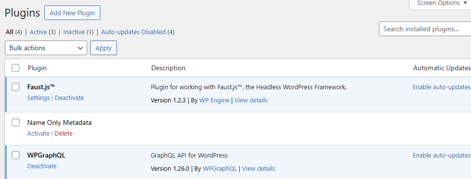

# Working with a Custom WordPress Plugin

## Why and What is a plugin in WordPress?

!!! quote Why plugins?
    If there’s one cardinal rule in WordPress development, it’s this: **Don’t touch WordPress core**. This means that you don’t edit core WordPress files to add functionality to your site. This is because WordPress overwrites core files with each update. **Any functionality you want to add or modify should be done using plugins.**

    WordPress plugins can be as simple or as complicated as you need them to be, depending on what you want to do...The plugin PHP file just needs a Plugin Header, a couple of PHP functions, and some hooks to attach your functions to.
    
    Plugins allow you to greatly extend the functionality of WordPress without touching WordPress core itself.
    
    (from https://developer.wordpress.org/plugins/intro/)

!!! quote What is a plugin?
    Plugins are packages of code that extend the core functionality of WordPress. WordPress plugins are made up of PHP code and can include other assets such as images, CSS, and JavaScript.

    By making your own plugin you are extending WordPress, i.e. building additional functionality on top of what WordPress already offers. For example, you could write a plugin that displays links to the ten most recent posts on your site.

    Or, using WordPress’ custom post types, you could write a plugin that creates a full-featured support ticketing system with email notifications, custom ticket statuses, and a client-facing portal. The possibilities are endless!

    (from https://developer.wordpress.org/plugins/intro/what-is-a-plugin/)

A properly thought through plugin, provides the opportunity to create a series of blocks and types that can easily be deployed to many WordPress sites, helping to standardize and expediate site development.

## Setup and Configuration

- a plugin relies on a minimum of one PHP script file, which registers the plugin with WordPress and defines the system hooks that apply the changes brought to the environment.
  - these changes could be new types, blocks, and even control of settings
- the sample code structure provides a basic plugin file named **rainflyadventrues-plugin.php** found at the root of the codebase
  - the bare minimum steps for configuration of the sample file are documented in [04 - Code Configuration under the heading 'Steps to configuring WordPress Plugin File'](./04-CodeConfiguration.md#configure-the-wordpress-plugin-file)
  - the remainder of this document will take a closer look at the elements of a plugin file.

### Required - Plugin Metadata

- for a PHP file to be recognized as registering a plugin and display as a valid plugin option in the plugin dashboard is that it must include a comment block of metadata.
- the following is taken from the sample project and will be used to describe the key details
- full header details found at [https://developer.wordpress.org/plugins/plugin-basics/header-requirements/](https://developer.wordpress.org/plugins/plugin-basics/header-requirements/)

```php
<?php
/**
 * Plugin Name:       Rainfly-Adventures
 * Description:       Sample Setup for single codebase for WordPress Plugin and Rendering Code
 * Plugin URI:        https://github.com/rainflyadventures/wp-plugin-sample
 * Requires at least: 6.1
 * Requires PHP:      7.0
 * Version:           0.1.0
 * Author:            Scott
 * License:           GPL-2.0-or-later
 * License URI:       https://www.gnu.org/licenses/gpl-2.0.html
 * Text Domain:       Rainfly Adventures
 */

```

Plugin Name
: Name of the plugin, will be displayed in the Plugin Dashboard for activation/deactivation
: this is the only field that must be included

Description
: Short description explaining the plugin, will be shown on the dashboard with the name

Plugin URI
: Unique URI to a website/page that provides additional details regarding the plugin

Requires at Least
: Enter the oldest version of WordPress that your plugin will support. This is for backwards compatibility

Requires PHP
: Similar to 'Requires at Least' list the oldest version of PHP that is required by the plugin. 
: This should normally align to the PHP version of the corresponding WordPress version

Version
: 3 part semantic versioning of the plugin
: As changes are made, the version should be changed appropriately to indicate a that an update is ready or has been applied.
: version comparison uses the PHP function *version_compare()* which does not behave as one would always expect. For example, a version of 1.02 is considered greater than version 1.1.

Author
: Name of plugin creator(s)
: Helpful information displayed on the dashboard

#### Examples

Following are some basic examples of the WordPress Plugin Dashboard and corresponding plugin meta data.

##### **Example 1**

```php
<?php
/**
 * Plugin Name:       My First Plugin
 * Description:       Sample Setup for single codebase for WordPress Plugin and Rendering Code
 * Requires at least: 6.1
 * Requires PHP:      7.0
 * Version:           2.5.1
 * Author:            Scott
 *
 */
```


##### **Example 2**

```php
<?php
/**
 * Plugin Name:       Name Only Metadata
 *
 */
```



##### **Example 3**

```php
<?php
/**
 * Plugin Name:       A Few Helpful Fields
 * Description:       Showing a description and URI
 * Plugin URI:        https://www.paragon-inc.com
 *
 */
```


## Plugin Hooks

- plugins are able to extend WordPress through a number of hooks provided by the WordPress Core
- Hooks allow for the execution of code during specific processes within WordPress Core
- Full hook reference information can be found at [https://developer.wordpress.org/plugins/hooks](https://developer.wordpress.org/plugins/hooks/)
- There exists two types of hooks to interact with:

Actions
: allow you to add data or change how WordPress operates.
: will run at a specific point in the execution of WordPress Core, plugins, and themes.
: Callback functions for Actions can perform some kind of a task, like echoing output to the user or inserting something into the database.
: Callback functions for an Action do not return anything back to the calling Action hook.

Filters
: give you the ability to change data during the execution of WordPress Core, plugins, and themes.
: Callback functions for Filters will accept a variable, modify it, and return it.
: They are meant to work in an isolated manner, and should never have side effects such as affecting global variables and output.
: Filters expect to have something returned back to them.

### Basics to **Action** Hooks

- [https://developer.wordpress.org/plugins/hooks/actions/](https://developer.wordpress.org/plugins/hooks/actions/)
- To run logic as part of an action hook there are two steps.
  - First, you must create a function (considered as a Callback Function) that performs one or more 'actions' you want to happen.
  - Second, the callback function created, is assigned (hooked) to a specific WordPress action via the **add_action()** method.
- A list of available actions that can be assigned see [https://developer.wordpress.org/apis/hooks/action-reference/](https://developer.wordpress.org/apis/hooks/action-reference/)

- Example 1: Hooking onto the 'init' action, used commonly to register custom types

```php
add_action('init', 'callback_fnc_name');

function callback_fnc_name(){
  // do something cool here
}
```

- Example 2: Hooking to an action while allowing data to pass through to the callback function
  - Look at the WordPress source code/documentation for the corresponding do_action method, this will list the parameters you have access to.
  - when you define your add_action method in the plugin, you define by count how many of the action's parameters get sent to the callback. Note, if you only want the last parameter you will need to request a count of all them.
  - include the proper number of parameters in your callback.

```php
// save_post, takes three parameters, being post_ID, post, and update
add_action('save_post', 'savepost_callback', 10, 2);

// creates a callback that recieves post id and post object for further action.
function savepost_callback($post_ID, $post){
  //do something with the post id
}
```

### Basics to **Filter** Hooks

- [https://developer.wordpress.org/plugins/hooks/filters/](https://developer.wordpress.org/plugins/hooks/filters/)
- An important differentiation from an Action, is that Filters are expected to work in an isolated manner, and should not cause 'side effects' to the environment such as changes to output or global variables
- Filters should always have a return statement.

```php
add_filter('filter-hook', 'my_callback');
function my_callback(){
  return a_value;
}
```

## Deploying Plugins

- the plugin definition PHP file (this has the [metadata header](#required---plugin-metadata)) should be at the root of a compressed file (ZIP) with any other additional files required/used by the plugin
- this compressed directory is then uploaded via the plugin dashboard or can be unzipped into the directory **/wp-content/plugins**

### Custom NPM Command

- as part of the sample project structure, there is included an NPM command to assist in packaging up you plugin (including any custom blocks) and deploying to the local WordPress environment.


!!! snippet plugin-zip
    ```"plugin-zip": "wp-scripts plugin-zip"```

    Uses WP Scripts, packages any blocks that have been build (see **plugin-build**) and the plugin PHP into a ZIP for deployment to a WordPress site.

    Additional details can be found at [https://developer.wordpress.org/block-editor/reference-guides/packages/packages-scripts/#plugin-zip](https://developer.wordpress.org/block-editor/reference-guides/packages/packages-scripts/#plugin-zip)

!!! snippet plugin-build
    ```"plugin-build": "wp-scripts build --webpack-src-dir=src/wp-blocks --output-path=blocks",```

    Using WP Scripts, compiles the block JavaScript to be consumable by WordPress for all blocks defined. 
    The output of the compiled code is placed into the blocks directory at the root of the source code, '/blocks'.

    Additional details can be found at [https://developer.wordpress.org/block-editor/reference-guides/packages/packages-scripts/#build](https://developer.wordpress.org/block-editor/reference-guides/packages/packages-scripts/#build)

!!! snippet plugin-deploy
    ```"plugin-deploy": "dotenvx run -f .env.local -- cross-var extract-zip ./PLUGIN_NAME.zip %PLUGIN_DIRECTORY%/PLUGIN_NAME"```

    Upon code setup and configuration the value **PLUGIN_NAME**, needs to be updated for the corresponding plugin that is to be deployed.

    This code reads the WordPress plugin directory configuration value for .env.local, using this value will extract the plugin zip as created via the commmand *plugin-zip* (or *plugin*) making the corresponding code (blocks, custom types, etc) available to the WordPress environment.

!!! snippet plugin
    ```"plugin": "npm run plugin-build && npm run plugin-zip && npm run plugin-deploy" ```

    Simplified run command that chains all the plugin related actions into a single command. Upon running, the plugin will be built, zipped, and finally deployed to the configured WordPress environment.

## Helpful and Important References

- [04 - Code Configuration under the heading 'Steps to configuring WordPress Plugin File'](./04-CodeConfiguration.md#configure-the-wordpress-plugin-file)
- [Plugin Handbook - Official WordPress documentation](https://developer.wordpress.org/plugins/)
- [https://developer.wordpress.org/plugins/hooks](https://developer.wordpress.org/plugins/hooks/)
  - [https://developer.wordpress.org/plugins/hooks/actions/](https://developer.wordpress.org/plugins/hooks/actions/)
  - [https://developer.wordpress.org/plugins/hooks/filters/](https://developer.wordpress.org/plugins/hooks/filters/)