# Custom Blocks

## What is the Block Editor, aka Gutenberg Block System?

Starting with WordPress 5.0, December 2018, a new editing system was introduced and set as the default experience. This new experience is called *block editor*, *WordPress editor*, or *Gutenberg editor*. The new editing system leverages a modular approach to creating content called **blocks**.

> Blocks are the content elements that you add to create content layouts. You can add blocks for paragraphs, images, headings, lists, videos, galleries, and more.
>
> You can control the layout of the blocks with ease, to build visually appealing web pages.

"A block is a discrete element such as a Paragraph, Heading, Media, or Embed. Each block is treated as a separate element with individual editing and format controls. When all these components are pieced together, they make up the content of the page or post, which is then stored in the WordPress database." (Quoted from [https://developer.wordpress.org/block-editor/](https://developer.wordpress.org/block-editor/))

Before digging into the creation of custom block, it is important to understand the interface the editors will be working within. The Block Editor has three primary areas:


The elements highlighted are:

1. **Inserter**: A panel for inserting blocks into the content canvas
2. **Content canvas**: The content editor, which holds content created with blocks
3. **Settings Panel**: A panel for configuring a block’s settings when selected or the settings of the post

## Using Blocks with Headless WordPress

The flexibility that blocks provides editors helps with site creation and maintenance, but does create difficulties in developing the rendering or headless portion of the site, as it is difficult (near impossible) to statically create template files to support the different combinations of the page layout. (This is not a problem unique to WordPress, but any headless site development where editors have the flexibility to order components/blocks at will.)

Just like with other systems some sort of looping-match mechanism must be put into place to parse the received data and make automated decisions on the proper component/block that should be rendered to the page. Logic like this can be custom built for each site, but to simplify development the headless site for WordPress will take advantage of the Faust.js SDK which includes pre-developed and tested logic for handling blocks.

### Basic Configuration Steps

To take advantage of the Faust.js SDK block handling there are a couple of steps that must be taken. (Most of these steps will be done as part of the larger project template, but are noted here for completeness.)

1. Install the npm package **@faustwp/blocks**

```powershell
npm i @faustwp/blocks --save
```

2. At the root of the src-directory for the application create a new directory named **wp-blocks**. This new directory will be the location of any custom blocks created.
3. Within the *wp-blocks* directory create a new file named **index.tsx**. *index.tsx* will work as a 'module' to provide a single export point for all the custom blocks created, the content of the file is simple to begin with:

```tsx
// scr/wp-blocks/index.tsx

export default {
};
```

4. The movement of the list of blocks for a page is handled through a custom provider-view components. The provider portion needs to be added to the **_app.tsx** file under pages. You are going to add the **WordPressBlocksProvider** component imported from *@faustwp/blocks*. This component is placed into the body of the app code and requires the existing *Component* component to be the child element.
  - **WordPressBlocksProvider** prop is a config object that has two properties
    - **blocks** - which is a name-value pair set, imported from wp-blocks/index.tsx. Where the name is the expected name/typename of the block returned from WordPress and the value being the export of the component.
    - **theme** - this is a BlocksTheme object, populated from a parsed theme.json file. In most cases this will be marked as NULL.

```tsx
// src/pages/_app.tsx

import '../../faust.config';
import React from 'react';
import { useRouter } from 'next/router';
import { WordPressBlocksProvider } from '@faustwp/blocks'; //<-- ADD REFERENCE TO FAUST BLOCK PACAKAGE
import { FaustProvider } from '@faustwp/core';
import blocks from '../wp-blocks'; //<-- ADD IMPORT TO THE LIST OF BLOCKS
import '../styles/global.scss';
import { AppProps } from "next/app";

export default function MyApp( { Component, pageProps }:AppProps ) {
	const router = useRouter();

	return (
		<FaustProvider pageProps={ pageProps }>
			<WordPressBlocksProvider //<-- INSERTION OF THE BLOCK PROVIDER
				config={ {
					blocks, {/*<-- NAME-VALUE LIST OF BLOCKS  */}
					theme: null, {/*<-- OPTIONAL BLOCK THEME OBJECT, MOST OFTEN MARKED AS NULL */}
				} }
			>
				<Component { ...pageProps } key={ router.asPath } /> {/*<-- CHILD ELEMENT TO THE PROVIDER */}
			</WordPressBlocksProvider>
		</FaustProvider>
	);
}
```

5. Within each template (found in src/wp-templates) or custom block that allows other blocks, you need to import and place the block viewer component **WordPressBlocksViewer**. The props for this component is *blocks* and is an array of block data as retrieved from the GraphQL query. A very basic use case would be:

```tsx
import { gql } from '@apollo/client';
import { flatListToHierarchical, useFaustQuery } from '@faustwp/core';
import { WordPressBlocksViewer } from '@faustwp/blocks';

export default function Component(props) {
  // Loading state for previews
  if (props.loading) {
    return <>Loading...</>;
  }
  // GraphQL Quaery
  const { post } = useFaustQuery(GET_POST_QUERY);
  
  const { title, content, featuredImage, date, author , editorBlocks} = post ?? {};

  // takes the flat editor block data and determines parent child relationship
  const blocksList = flatListToHierarchical(editorBlocks);
  
  return (
    <>
      <div>
          {/* Using Faust.js to parse the blocks and render them */}
          <WordPressBlocksViewer blocks={blocksList}></WordPressBlocksViewer>
        </div>
    </>
  );
}
```

## Basics Editing Behavior Exist

- Out of the bock a number of blocks exists to support common things such as rich text, images, link buttons, and columns
  - a full list of available blocks can be found at [https://wordpress.org/documentation/article/blocks-list/](https://wordpress.org/documentation/article/blocks-list/)
- Faust.js SDK includes a package named **@faustwp/blocks** that provides default querying and rendering capabilities for the majority of these default blocks
- Allowing editors to immediately take advantage of the block functionality to build sites
- You can easily overwrite the default rendering behavior by creating a component and setting the **displayName** property to the Core Block property, and appropriately making in the wp-blocks/index.tsx file
- This overwrite behavior is specific to the rendering of the site, for changes to the editing experience, a full custom block is required

## Custom Block Creation

To help editors meet the design standards set for the site, but not totally limit the flexibility of the block editor, it is possible to create custom blocks that can be packaged as part of a plugin and deployed to the WordPress site, while sharing logic, code, and styles used by the rendering site. There are two basic methods to custom block creation, the first to explore will be the standard WordPress process, then we will take a look at building a custom block built using Faust.js.

There are a number of duplicated steps required by both methods of block creation.

### Directories and Files to Understand

No matter which method is used to register the block within WordPress there are common files that must be completed in all instances.

As has been noted above, and other documents, blocks are created and managed from within **../src/wp-blocks**.

Each block will be defined by a directory within *wp-blocks* and include the minimal following files: block.json, index.tsx, Edit or Component.jsx.

**block.json**
: The block.json includes important metadata about the blog to be registered within WordPress. When registering a block via the plugin, this file is referenced, not the actual component code.
: Is it used to name the block, description, category, and icon that displays in the block picker during editing
: Also, the block.json is where you define the fields or attributes the editor will be able to complete when the add the block to a page or post
: The file is automatically created when running the WordPress CLI create-block command (as defined for the sample project structure as ```npm run add-block```), but can also be manually generated as shown with the bare minimum properties (not all shown are 'required' but best practice to include).
: Reference to the full JSON schema [https://developer.wordpress.org/block-editor/reference-guides/block-api/block-metadata/](https://developer.wordpress.org/block-editor/reference-guides/block-api/block-metadata/)
: This file does not change between a standard WordPress block and a Faust.js based block

  ```json
  {
    // OPTIONAL, but helpful in providing intellisense in editors for completing and checkign the JSON
    "$schema": "https://schemas.wp.org/trunk/block.json",

    // REQUIRED, unique string that identifies a block,
    // - Will be the block 'typename' when requesting data through GraphQL and used for matching to rendering component
    // - Can only contain lowercase alphanumeric characters and dashes
    // - Optionally, a namespace plus slash can be prepended but this causes odd serialization behavior with GraphQL
    "name": "NAMESPACE/BLOCK-NAME",
    
    // REQUIRED, Editor friendly title of the block, will be displayed in the block editor for selection
    "title": "FRIENDLY BLOCK NAME",

    // OPTIONAL, Short description displayed in the block inspector.
    "description": "Example block description.",

    // OPTIONAL, Defines the 'category' for organization of the block.
    // - default options are: text, media, design, widgets, theme, embed
    // - it is possible to register custom categories to place blocks in as part of a theme or plugin
    "category": "widgets",

    // OPTIONAL, WordPress Dashicon that helps to identify the block when selecting
    "icon": "smiley",

    // OPTIONAL, defines the structure of the data that the block requires
    // - for more details see https://developer.wordpress.org/block-editor/reference-guides/block-api/block-attributes/
    "attributes": {
      "headline": // FIELDNAME that is referenced by the component code
        { 
          "type": "string", // defines the type of data that will be stored          
          "default": "Hello World" // default value that will pre-load for the block, helpful in providing simple direction to an editor
        },
    },

    // REQUIRED, path to the compiled JavaScript that supports the editing capabilities of the block
    "editorScript": "file:./index.js",
    // OPTIONAL, path to the compiled CSS for supporting editing, must include if you want to load any rendering compontent CSS during editing
    "editorStyle": "file:./index.css",
  }
  ```

**index.tsx**
: this file is the first step in registering a custom block for WordPress
: there are two formats to this file depending on if you are building a standard WordPress block or leveraging the Faust.js block format

  ```tsx
  // index.tsx for a standard WordPress custom block

  // REQUIRED, import registerBlockType function from the WordPress API
  import { registerBlockType } from '@wordpress/blocks';

  // REQUIRED, import of the edit or component
  import Edit from './edit';

  // REQUIRED, import the metadata from block.json
  import metadata from './block.json';

  // REQUIRED, call the register block method passing in the block name as defined in the block.json and the component
  registerBlockType( metadata.name, {
    edit: Edit,
    // When building a non-headless WordPress site, custom blocks must save the rendered HTML that will be used to serve the content.
    //   This is generated and stored via a Save component.
    //   Performing a render of HTML during save is not helpful in a headless scenario, and thus this property can be ignored/skipped
    //save: Imported-Save-Component 
  } );
  ```

: The index.tsx for a Faust.js based block looks very similar, but leverages a different register function out of the Faust.js SDK

  ```tsx
  // index.tsx for a Faust.js based block

  // REQUIRED, import registerFaustBlock function from the Faust.js API
  import { registerFaustBlock } from '@faustwp/block-editor-utils';

  // REQUIRED, import of the edit or component
  import Edit from './edit';

  // REQUIRED, import the metadata from block.json
  import metadata from './block.json';

  // REQUIRED, call the register block method
  //  First parameter is the component
  //  Second parameter is the block.json 
  registerFaustBlock(Edit, {
    blockJson: metadata
  });
  ```
  
**Edit or Component.tsx**
: This file will include the rendering code that will be supported by the editor
: In a Faust.js based block, this will double as the headless rendering code for the site
: For standard WordPress custom block, this file will be specific to the editing experience as shown in the [Creating Standard WordPress Custom Blocks]
(#creating-standard-wordpress-custom-blocks)

### Creating Standard WordPress Custom Blocks

#### Step 1 - Setup of Basic File Structure and Plumbing the Block Registration

- The following will outline the procedure for creating and registering a custom block following standard WordPress steps.
- This is the preferred block creation if you need to support specifically images or links, as you have the ability to define how the editor can enter the appropriate content
- The procedure defined here is meant to allow for a successful editing experience while also limiting the duplication of rendering code

For these steps a block named **SampleCTA** will be created. The repository contains the final code for the block.

1. Generate the block file structure via running ```npm run add-block`` (or create it manually per section [Directories and Files to Understand](#directories-and-files-to-understand), after creating the files skip to step 10)
2. At the prompt you'll be asked if you want a static or dynamic variant. Select **dynamic**
3. Provide the name of the block, must be all lowercase and alphanumeric, with optional dashes
4. Provide the title of the block, this is used for display purposes
5. Enter the description of the block
6. Enter the name of a Dashicon to identify this block with, find a list of dashicons at [https://developer.wordpress.org/resource/dashicon](https://developer.wordpress.org/resource/dashicon)
7. Select the which the widget will be organized into. (If you plan to register a custom category, this will be done manually in the block.json.)
8. Allow the code to complete, this should result in the following

    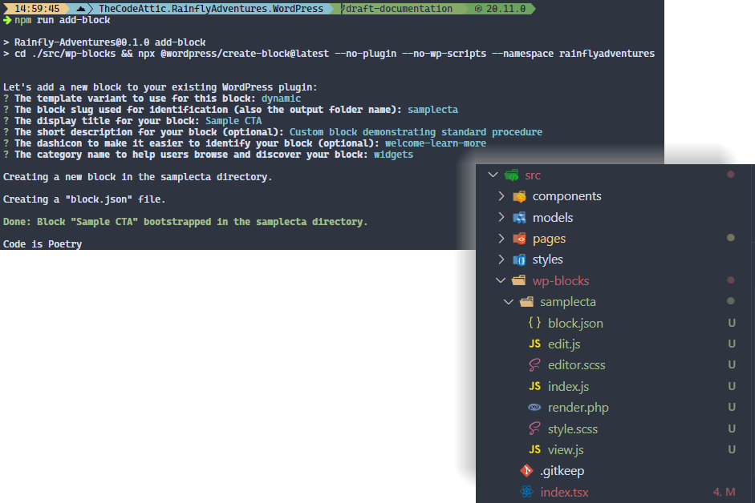

9. Because this is a headless implementation there are some changes to the base file structure we want to make.
   1. Delete the following files
      - editor.scss
      - render.php
      - style.scss
      - view.js
   2. Rename *index.js* to **index.tsx**
   3. Rename *edit.js* to **edit.tsx**

    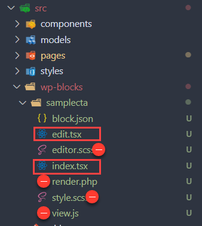

10. With the file structure inplace we can begin to build out the block. The first file to manipulate is the **block.json**
    1. As the block.json, provides details about the block, we need to remove references to the file we just deleted, thus the following lines:
        - "style": "file:./style-index.css"
        - "render": "file:./render.php"
        - "viewScript": "file:./view.js"

    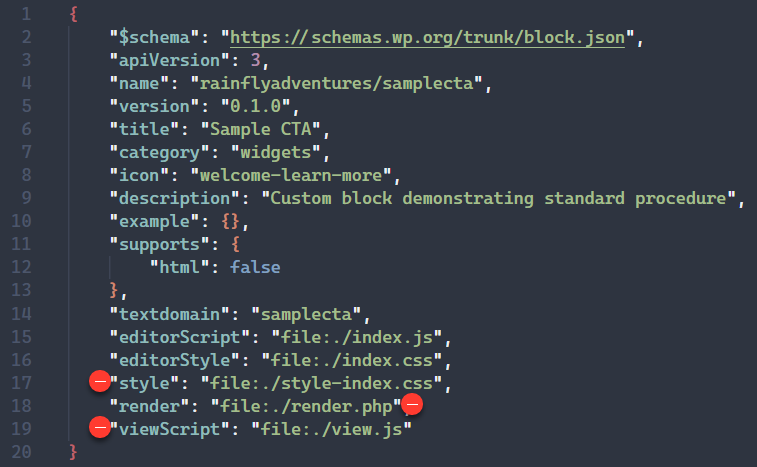

11. While still in the **block.json** we need to add the attributes or data fields that will be managed by the block. For the sampleCTA there will be a headline, image, and link that will be managed. Block data storage can only handled simple data types, see [https://developer.wordpress.org/block-editor/reference-guides/block-api/block-attributes/#type-validation for a list of allowed types](https://developer.wordpress.org/block-editor/reference-guides/block-api/block-attributes/#type-validation). The attribute list will be similar to the following:

    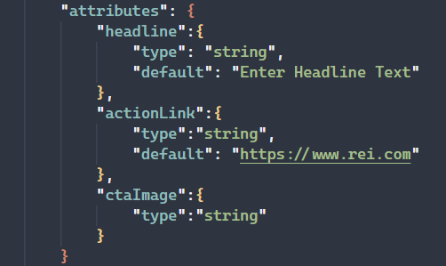

    Resulting **block.json** should appear something like that following
    ```json
    {
      "$schema": "https://schemas.wp.org/trunk/block.json",
      "apiVersion": 3,
      "name": "rainflyadventures-samplecta",
      "version": "0.1.0",
      "title": "Sample CTA",
      "category": "widgets",
      "icon": "welcome-learn-more",
      "description": "Custom block demonstrating standard procedure",
      "example": {},
      "supports": {
        "html": false
      },
      "textdomain": "samplecta",
      "editorScript": "file:./index.js",
      "editorStyle": "file:./index.css",
      "attributes": {
        "headline":{
          "type": "string",
          "default": "Enter Headline Text"
        },
        "actionLink":{
          "type":"string",
          "default": "https://www.rei.com"
        },
        "ctaImage":{
          "type":"string"
        }
      }
    }
    ```

12. The next step to take, so as not to forget, is to update the plugin PHP code, to register the block. Without registering the block in the plugin file, the block will never be made available to use. Open **rainflyadventures-plugin.php** and add the following snippet:
    ```php
    // add_action hook that ties the register logic to the init process of WordPress
    add_action( 'init', 'register_custom_blocks' );

    // custom method which will defines in this case the blocks to be registered
    function register_custom_blocks() {

      //register action, the second parameter is the path to the block files as packaged by the plugin.
      // the base project struture provided always packages into 'blocks' as the parent directory
      register_block_type( __DIR__ . '/blocks/samplecta' );	
    }
    ```

13. The next step to configuring the *plumbing* of for a block is to update the **index.tsx**. Registering a block looks first at the block.json as defined as either a child of the folder or directly in the plugin registeration, from the block.json WordPress determines the index file for full ingestion of the block.

    Because we are working in the context of a headless rendering model, the index file is only concerned with registering the edit logic as display for editing, thus the file is fairly simple and looks as follows:
    ```tsx
    //index.tsx of a custom block

    // import of the register method from the WordPress blocks API package
    import { registerBlockType } from '@wordpress/blocks';

    // import the edit component from the corresponding Edit.tsx file
    import Edit from './edit';

    // import the block.json meta data for the block
    import metadata from './block.json';

    // registration of the block is done by sending the block name as defined in the block.json and assigning the edit component to the edit property
    // if we wanted to save rendered HTML we could also assign a component to the save property (this is useful for traditional WordPress sites)
    registerBlockType( metadata.name, {
      edit: Edit,
    } );
    ```

14. Before you can successfully make a quick test of the block, you need to open **edit.tsx** and remove the import reference to **editor.scss**.
    ```tsx
    import './editor.scss';
    ```

#### Step 2 - Build, Activate, and Test the Block

1. Ensure all the files have been saved, and at the terminal run the command ```npm run plugin``` to compile and deploy the block as part of the custom plugin.
2. In the browser open the WordPress admin dashboard, confirm the custom plugin is activated, if not activate it

  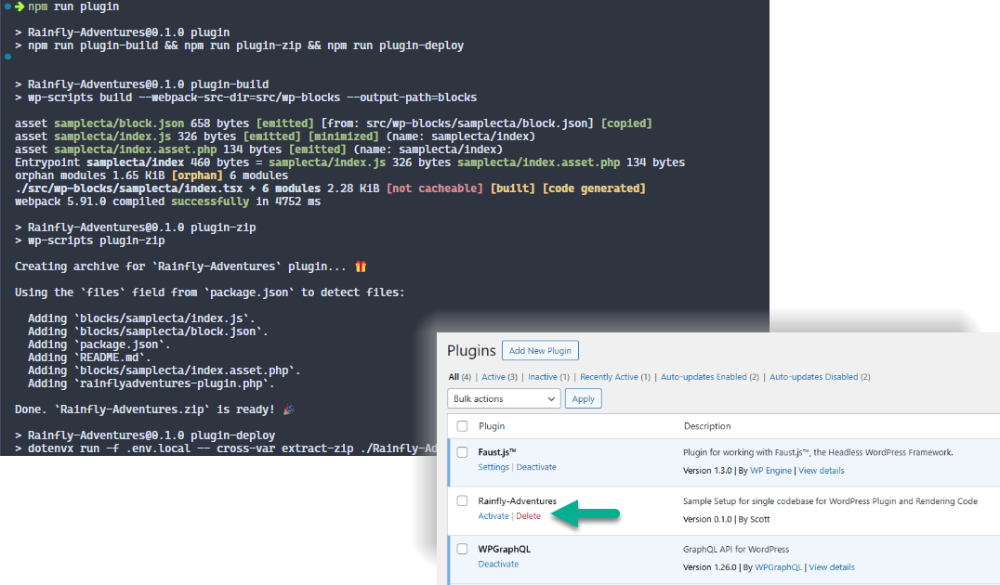

3. Create a new post or page, and add the custom block **Sample CTA**

  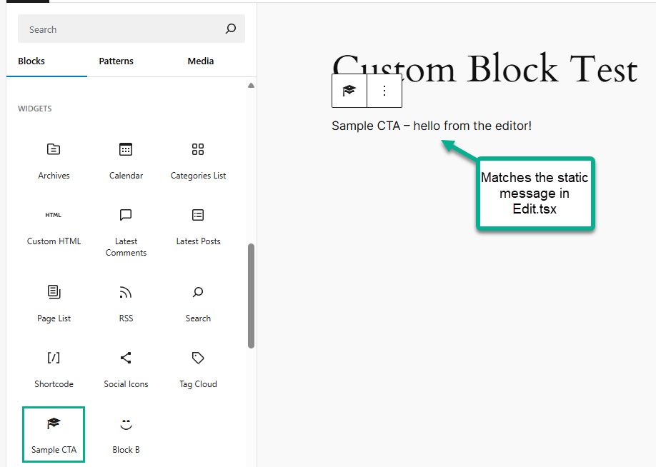

#### Step 3 - Edit.tsx

With confirmation that the plugin loads correctly in WordPress and registers the block for use, the next step is to provide context to interact with the content (block attributes) to be managed. The *Edit.tsx* will be the component logic which is ran when a block is added to the canvas.

1. As a lazy developer the less code that needs to be written the better, we will create a sibling component file which is the display rendering of the block's attributes. This is the component that the delieverd headless site will display. The new file will be named **samplecta.tsx**. As a starting point set the contents as follows:
    ```tsx
    //import the corresponding module styles for use
    import styles from './samplecta.module.scss';

    //function based component definition
    function SampleCTA(props:any) {

      return (
        <>
          <div className={styles.ctawrapper}>					
            <h3>This is the rendering component</h3>
          </div>
        </>
      );
    }

    //export of component for usage/access
    export default SampleCTA; 
    ```

2. Create a corresponding module style file named **samplecta.module.scss**, populate as follows:
    ```scss
    .ctawrapper{
          border: 3px solid rebeccapurple;
    }
    ```

3. Open **Edit.tsx**, add an import to the rendering component that was just created and add it as part of the return. Redeploy the plugin (```npm run plugin```) and refresh the page. This should result in displaying the message for the component.

    ```tsx
    // update to Edit.tsx
      import { __ } from '@wordpress/i18n';
      import { useBlockProps } from '@wordpress/block-editor';
      import SampleCTA from './samplecta';

      export default function Edit() {
        return (
          <>
            <p { ...useBlockProps() }>
              { __( 'Sample CTA – hello from the editor!', 'samplecta' ) }
            </p>
            <SampleCTA></SampleCTA>
          </>
        );
      }
    ```

    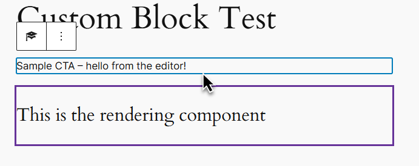

4. An important element of the block editor is the toolbar and border shown when a block has been selected. In the image above, it can be see that this block-border does NOT wrap the entire contents. This selection indicator is tied to the **useBlockProps()** expansion method, so should be moved to a wrapping container, like
    ```tsx
    // update to Edit.tsx
      import { __ } from '@wordpress/i18n';
      import { useBlockProps } from '@wordpress/block-editor';
      import SampleCTA from './samplecta';

      export default function Edit() {
        return (
          <>
            <div { ...useBlockProps() }>
              <p>	
                { __( 'Sample CTA – hello from the editor!', 'samplecta' ) }
              </p>
              <SampleCTA></SampleCTA>
            </div>
          </>
        );
      }
    ```

    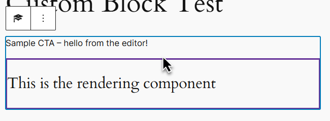

#### Step 4 - Creating the Edit Experience

Now that we have some basic files inplace, the next step in the process is applying the fuller code to *Edit.tsx* for a successful editing experience of the block attributes.

[https://developer.wordpress.org/block-editor/getting-started/fundamentals/block-in-the-editor/](https://developer.wordpress.org/block-editor/getting-started/fundamentals/block-in-the-editor/)

Sample code demonstrated will be from the custom block **ctawithprops**.

##### Edit Component Props

The default props object for a block contains three main properties

- **attributes**: An object of all the block’s attributes.
- **setAttributes**: A method to update the attributes object.
- **isSelected**: A boolean value that communicates whether the block is currently selected

There are two common ways to define the edit component function. The first and most common is to expand the above properties out of the props as follows:

```tsx
// most common edit component declaration

export function Edit({attributes, setAttributes, isSelected}){
  //left blank
}
```

The above provides the required access, but does not included type-safe values for us, which is benicifal part of TypeScript, thus we can define the edit function as:

```tsx
import { BlockEditProps } from 'wordpress__blocks/index';

// Define an interface for the attributes of the block

export interface CTAProps extends Record<string, any> {	
		headline: string|null,
		actionLink: string|null,
		ctaHero: string|null
}

// using the generic feature of BlockEditProps, to define the type for the attribute list
export function Edit(props:BlockEditProps<CTAProps>){
  // left blank
}
```

Leveraging this second approach, then allows you to use the same interface definition for the attributes in the rendering component, thus having type-checking between the files.

##### Working with Attributes

The 'CTA with Props' block is defined with three attributes:
- *headline* - a string, representing rich text
- *actionLink* - a string, that is to be a link for clicking
- *ctaHero* - a string, that will store a selected image for display

The **block.json** would be defined as follows with defaul text

```json
{...
"attributes": {
		"headline":{
			"type": "string",
			"default": "Enter Headline Text"
		},
		"actionLink":{
			"type":"string",
			"default": "https://www.rei.com"
		},
		"ctaHero":{
			"type":"string",
			"default": "http://rainflyadventures.local/wp-content/uploads/2024/05/76919a3104c15fc9_8434-w300-h300-b1-p0-.jpg"
		}
	}
}
```

To access the data stored in the attributes (either as an editor has entered or pulling the defaul values) simply call into the attributes propery of the props:

```tsx
// wp-blocks/ctawithprops/edit.tsx

// Example of accessing and displaying the block's attribures
export function Edit(props: BlockEditProps<CTAProps>) {	
	return (
		<div {...useBlockProps()}>
				<p>
            {__('CTA With Props – hello from the editor!', 'CTAWithProps')}
            <br />
            {props.attributes.actionLink}
            <br />
            {props.attributes.headline}
            <br />
            {props.attributes.ctaHero}
            <br/>
        </p>
		</div>
	);
}
```

This will result in the following editor expereince:

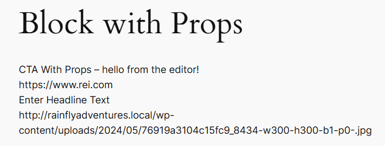

Displaying defaulted text is not very helpful for an editor, as in this form they cannot manipulate the content. (Reminder, that setting default values is helpful in the initial render of the block once added to the canvas, and is an excellent way to provide instructions to editors.)

Editing of the related content can be performed either in the main canvas area or within the side-bar. Access to different editing experiences for the content is produced via reference to components found in '@wordpress/block-editor' and '@wordpress/components' packages.

The general pattern used for editing and saving attribute content leverages accessing the data via **props.attributes.ATTRIBUTE_NAME**, and saving data via the *onChange* or *onSelect* event of the edit component to which calls the props' **setAttributes** method.

###### Editing within the Canvas

For the editing experience to be directly in the canvas area, the appropriate block-editor and compontent controls are added as part of the edit rendering.

To support rich text, you will want to leverage the [Rich Text component from the block-editor pacakge.](https://github.com/WordPress/gutenberg/tree/trunk/packages/block-editor/src/components/rich-text) This component provides all the features of the rich text editor found in WordPress, even allowing control over which rich text capabilities are allowed. 

```tsx
// wp-blocks/ctawithprops/edit.tsx

// Example of rich text editing
export function Edit(props: BlockEditProps<CTAProps>) {
	return (
		<div {...useBlockProps()}>
				<p>
					{__('CTA With Props – hello from the editor!', 'CTAWithProps')}
					<br />
					{props.attributes.actionLink}
					<br />
					<RichText
            // optional, but strongly encouraged to use
            //   block attribute that content is to be bount to
            //   if set you do not have to  map the attribute on the setAttributes method
            identifier="headline"

            // optional, defines the wrapping HTML-tag for the content...default is DIV
						tagName="p"
						
            // required, leveraging the onChange event to allow for saving the data as edited
            //  this takes advantage of the 'setAttributes' method provided in the props as part of 'BlockEditProps' type
            //  the parameter of setAttributes is always an object of the attribute name assiged the value
            onChange={ (el) => props.setAttributes({ el }) }
            
            // optional, ability to define the formats/actions allowed in the rich text control
						allowedFormats={ [ 'core/bold', 'core/italic' ] }

            // required, assign the attribute value which has been stored
						value={ props.attributes.headline }

            // optional, assign placeholder text for when the attribute contains nothing
						placeholder={ 'Write the headline...' }
						/>
					<br />
					{props.attributes.ctaHero}
					<br/>
				</p>
		</div>
	);
}
```

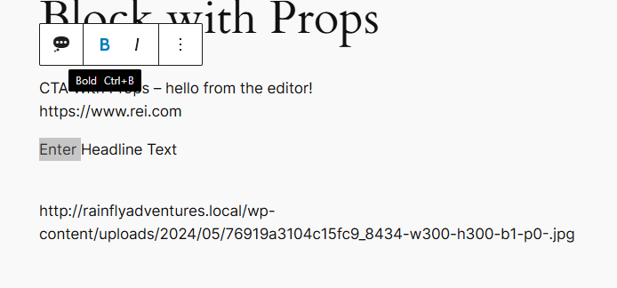

To work with links (the 'actionLink' attribute in the example) there are two options for providing URL selection from within the site or assigning external URLs. Components to support this are **URLInputButton** and **URLInput**. The **URLInputButton** provides only a link button that can be clicked and presented with the link selector, as shown in the example, it is helpful to inlcude a static display of the current link value. The **URLInput** renders the URL selector box directly to the screen.

```tsx
// wp-blocks/ctawithprops/edit.tsx

// Example of link editing
export function Edit(props: BlockEditProps<CTAProps>) {
	return (
		<div {...useBlockProps()}>
			<p>{__('CTA With Props – hello from the editor!', 'CTAWithProps')}</p>

			<div style={{display: 'inline-flex'}}>
        <span style={{'margin-right': '5px'}}>{props.attributes.actionLink}</span>
        <URLInputButton
          url={props.attributes.actionLink}
          onChange={(url) => props.setAttributes({ actionLink: url })} />
			</div>
			<br />

			<URLInput
				value={props.attributes.actionLink}
				onChange={(url) => props.setAttributes({ actionLink: url })} />
			<br />
			
      ....

		</div>
	);
}
```

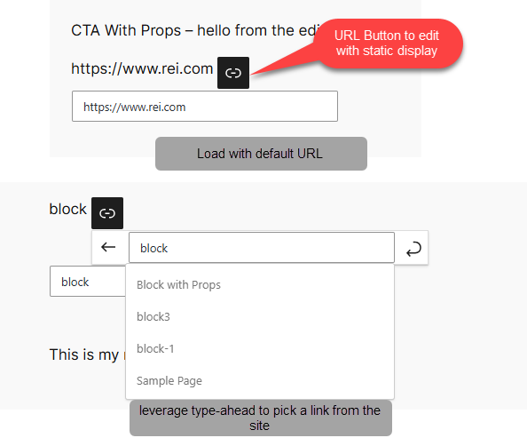

When working with links it is helpful to be able to capture label text to render with the link. This text must be tracked via a seperate block attribute, thus we add the following to *block.json*:

```json
{
  ...,
  "attributes":
  {
    ...,
    "actionLabel":{
			"type":"string",
			"default": "Click Me!"
		}
  }
}
```

The other update required is to add a 'post or page' parameter to the onChange event for the URL components. This will allow you to capture the post or page title as the action label. You will also want to include a **PlainText** compontnet to allow setting the action label for external URLs.

```tsx
// wp-blocks/ctawithprops/edit.tsx

//Version 4 - Link Editing with Action Label Assignment
export function Edit(props: BlockEditProps<CTAProps>) {
	return (
		<div {...useBlockProps()}>
			<p>{__('CTA With Props – hello from the editor!', 'CTAWithProps')}</p>

			<div style={{display: 'inline-flex'}}>
				<span style={{'margin-right': '5px'}}>{props.attributes.actionLink}</span>
				<URLInputButton
					url={props.attributes.actionLink}
					onChange={(url, post) => props.setAttributes({ actionLink: url, actionLabel: (post && post.title)||props.attributes.actionLabel })} />
			</div>
			<br />
			<PlainText 
				value={props.attributes.actionLabel}
				onChange={(lbl)=> props.setAttributes({actionLabel:lbl})}/>			
		...
		</div>
	);
}
```

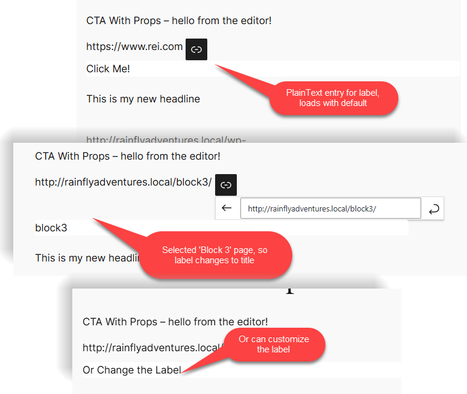

The final attribute we want to configure to edit is *ctaHero* which is suppose to be an image. Similar to links, the block attributes will store only the URL of the image, while it is still possible to provide an interactive upload and selection process.

To provide a full media experience, including direct upload to the media library as well as selecting from existing media elements, two block-editor components are required. First, a **MediaUploadCheck** (see more at [https://github.com/WordPress/gutenberg/tree/trunk/packages/block-editor/src/components/media-upload](https://github.com/WordPress/gutenberg/tree/trunk/packages/block-editor/src/components/media-upload)) is placed on the page. This provides automatic permission checking that a user has access to the media library and what level of access they are allowed. As a child to this component you place a **MediaPlaceholder**. This is the component that renders the actual image selection process, by default, there is no preview of the selected image, so you must include a child image element to render a thumbnail for display.

Key attributes to **MediaPlaceholder** are:

- *onSelect* -> similar to the onChange for the text based edit components, this function allows for calling the setAttributes function to save the selected data.
  - by default the onSelect provides a full media object which includes the following properties: url, alt, id, link, caption, sizes, media_details
  - each property needs to be saved to a unique attribute within the block.
- *allowedTypes* -> an array of the types of media that is allowed to be uploaded as well as selected.
  - Values can be in the simplified form of 'image', 'audio', 'text' or be a fulle mime type
- *multiple* -> accepts a true or false, depending on if multiple images are allowed to be selected, as when selecting for a gallery
- *labels* -> object with two properties for providing context to the user.
  - ```{title: 'Title label for the Component', 'instrcutions': 'Long form details as to what should go here'}```
  - useful in providing reminder of recommended dimensions for the the use case
- additional properties can be reviewed in the documentation at [https://github.com/WordPress/gutenberg/blob/trunk/packages/block-editor/src/components/media-placeholder/README.md](https://github.com/WordPress/gutenberg/blob/trunk/packages/block-editor/src/components/media-placeholder/README.md)

```tsx
// wp-blocks/ctawithprops/edit.tsx

//Version 5 - Image Editing
export function Edit(props: BlockEditProps<CTAProps>) {
	return (
		<div {...useBlockProps()}>
			<p>{__('CTA With Props – hello from the editor!', 'CTAWithProps')}</p>
      ...
			<br />
			
			<MediaUploadCheck>
				<MediaPlaceholder								
					onSelect={(el) => props.setAttributes({ ctaHero: el.url, ctaHeroAlt: el.alt })}
					allowedTypes={['image']}
					multiple={false}
					labels={{ title: 'Action Image', 'instructions': 'Select or Upload an image to use in the CTA' }}>
						
				</MediaPlaceholder>
			</MediaUploadCheck>
			<br />
		</div>
	);
}
```

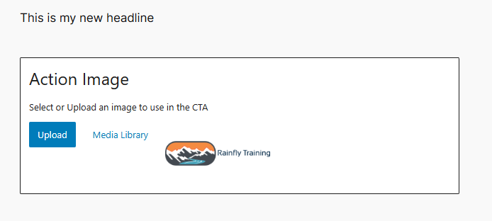

###### Editing Beyond the Canvas

Editing within the canvas is nice, but can be a bit disrupt nor is it the best scenario for some elements, such as images or non-visible settings such as CSS class options. Components nested within the **InspectorControls** component will render not in the canvas area but within the sidebar upon block selection. (InspectorControls is imported from the block-editor package.)

Expandable sections within the sidebar are produced through the usage of **PanelBody** and **PanelRow** components. (PanelBody and PanelRow are imported the components package.)

The actual editing of attributes content is done via the same collection of components leveraged with in the canvas but are now placed in the sidebar. For example taking our current CTA component we can move the action link and action label to the sidebar for editing.

[Reference Document for Inspector Controls: https://github.com/WordPress/gutenberg/tree/trunk/packages/block-editor/src/components/inspector-controls](https://github.com/WordPress/gutenberg/tree/trunk/packages/block-editor/src/components/inspector-controls)

```tsx
// wp-blocks/ctawithprops/edit.tsx


//Version 6 - Sidebar Editing via Inspector Controls
export function Edit(props: BlockEditProps<CTAProps>) {
	return (
		<>
			<InspectorControls>
				<PanelBody title='Action Link and Label' initialOpen={true}>
					<fieldset>
						<div>
							<URLInputButton
								url={props.attributes.actionLink}
								onChange={(url, post) => props.setAttributes({ actionLink: url, actionLabel: (post && post.title)||props.attributes.actionLabel })} />
							<span style={{ marginRight: '5px' }}>{props.attributes.actionLink}</span>							
						</div>
						<TextControl label='Provide Action Label'
							value={props.attributes.actionLabel}
							onChange={(lbl)=> props.setAttributes({actionLabel:lbl})}/>
					</fieldset>
				</PanelBody>
			</InspectorControls>
		
			<div {...useBlockProps()}>
				<p>{__('CTA With Props – hello from the editor!', 'CTAWithProps')}</p>
				<a href={props.attributes.actionLink}
					style={{ border: '2px solid green', padding: '10px', borderRadius: '15px'}}>{props.attributes.actionLabel}</a>				
				<br />						
			  ....
			</div>
		</>		
	);
}
```

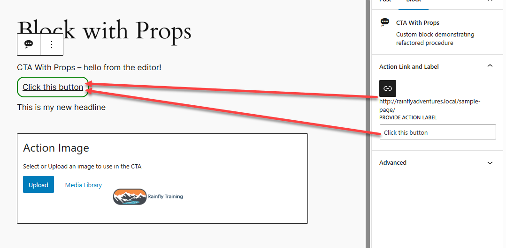

#### Step 5 - Introducing the Rendering Component

Up to this point we have looked at editing the block's attributes within WordPress, but this doesn't demonstrate how we can a) provide a more clear visual representaiton during editing of the page and b) what occurs at page render time.


### Custom Blocks with Faust.js

- https://faustjs.org/guide/creating-a-custom-block


* https://github.com/WordPress/gutenberg/tree/trunk/packages/block-editor/src/components


## Controlling Available Blocks During Editing

https://make.wordpress.org/core/2020/01/23/controlling-the-block-editor/


## Resources

- [Official WordPress Documentation: Block Editor Handbook](https://developer.wordpress.org/block-editor/)
- [Details on the registering React component as a blocks via Faust](https://github.com/wpengine/faustjs/issues/1522)